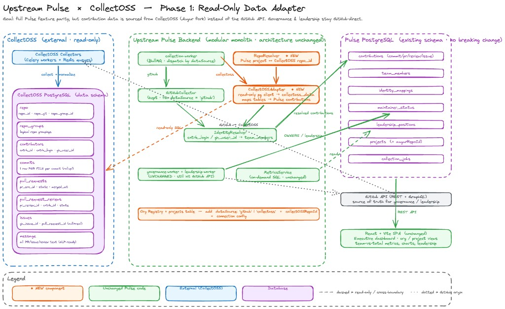

# CollectOSS Integration Plan — Dual-Backend Architecture

## Goal

Source contribution data from the OSPO data team's CollectOSS/Augur database instead of collecting it directly from the GitHub API. Governance, leadership, team identity, metrics, AI insights, and the entire React dashboard remain in Upstream Pulse. A per-project toggle allows switching between GitHub-direct and CollectOSS backends — no lock-in to either.

## Principle

The `contributions` table is a **stable interface**. Both backends write into it in the same format. Everything above it (MetricsService, frontend, insights) sees no difference.

---

## Architecture

```
                        ┌─────────────────────────┐
                        │   React Dashboard        │  unchanged
                        └────────────┬────────────┘
                                     │
                        ┌────────────┴────────────┐
                        │   MetricsService         │  unchanged — queries contributions table
                        └────────────┬────────────┘
                                     │
                        ┌────────────┴────────────┐
                        │   contributions table    │  stable interface, same schema
                        └──────┬────────────┬─────┘
                               │            │
                  ┌────────────┴──┐   ┌─────┴───────────────┐
                  │ GitHubCollector│   │ CollectOSSAdapter    │
                  │ (existing)     │   │ (new)                │
                  └────────────┬──┘   └─────┬───────────────┘
                               │            │
                         GitHub API    Augur DB (eightknot.osci.io)
```

### What each component does

| Component | Role | Status |
|---|---|---|
| **collection-worker** | Dispatches to GitHubCollector or CollectOSSAdapter based on project.dataSource | Modified — add dispatch logic |
| **GitHubCollector** | Collects from GitHub API, writes to contributions table | Stays permanently |
| **CollectOSSAdapter** | Reads from Augur DB, writes to contributions table | NEW |
| **RepoResolver** | Maps Pulse project (org/repo) to Augur repo_id | NEW |
| **IdentityResolver** | Matches contributor logins to team_members. Enhanced to use Augur's cntrb_login/gh_user_id | Enhanced |
| **MetricsService** | Queries contributions table, computes team vs. total | Unchanged |
| **governance-worker** | Parses OWNERS/CODEOWNERS via GitHub API | Unchanged |
| **leadership-worker** | Extracts steering/TSC/SIG chairs via GitHub API | Unchanged |
| **team-sync-worker** | Syncs GitHub org members to team_members | Unchanged |
| **AI Insights** | Gemini analysis | Unchanged |
| **React Dashboard** | Entire frontend | Unchanged |

---

## Data Source: OSPO Data Team's Augur Instance

The OSPO Aspen team runs an Augur instance at `eightknot.osci.io`.

**Provided:**
- PostgreSQL database (`augur` DB, `augur_data` schema)
- Commits, PRs, reviews, issues, contributor profiles, messages
- SSH tunnel for dev: `ssh -L 5411:localhost:5432 <username>@eightknot.osci.io`
- Database refreshed weekly (~12 hours refresh time, mostly 8Knot materialized views)
- Production access available via Adrian Edwards (adredwar@redhat.com) or `#proj-ospo-aspen`

**Schema stability (from Adrian Edwards, Jun 9):**

> "The data schema is subject to potentially breaking changes. Advance warning may or may not be given. The recommendation for usecases requiring stability is to use the 'stable' schema that is being introduced."

**Implication:** Write the adapter against `augur_data` tables initially. Migrate to the stable schema once it's available. The adapter pattern ensures this is a single-file change.

---

## Per-Project Data Source Toggle

### Three levels of configuration

**1. Environment** — Is CollectOSS available?

`AUGUR_DATABASE_URL` is optional. If not set, CollectOSS backend is unavailable. Upstream Pulse works exactly as it does today (GitHub-direct only).

**2. Default** — What do new projects default to?

`DATA_SOURCE_DEFAULT` config value: `'github'` (default) or `'collectoss'`.

**3. Per-project** — The `dataSource` field on the projects table.

Each project has `dataSource: 'github' | 'collectoss'`. Toggled via admin API. The collection-worker reads this field and dispatches accordingly.

### Dispatch logic

```
project.dataSource === 'collectoss'
  → CollectOSSAdapter reads from Augur DB → writes to contributions table

project.dataSource === 'github'
  → GitHubCollector calls GitHub API → writes to contributions table
```

Both paths produce identical rows in the `contributions` table. Same columns, same dedup key (`projectId + contributionType + githubId`).

### Validation rules

- Cannot set `dataSource='collectoss'` if `AUGUR_DATABASE_URL` is not configured
- Cannot set `dataSource='collectoss'` if the project has no `augurRepoId` (repo must exist in Augur)
- Switching dataSource: next scheduled collection uses the new backend. Existing data stays — new data overlays via upsert.

---

## Schema Changes to Upstream Pulse

### projects table — add two columns

```sql
ALTER TABLE projects ADD COLUMN data_source VARCHAR(20) DEFAULT 'github';
ALTER TABLE projects ADD COLUMN augur_repo_id INTEGER;
```

- `data_source`: `'github'` or `'collectoss'` — controls which backend collects for this project
- `augur_repo_id`: the `repo_id` from Augur's `augur_data.repo` table. Nullable — only set for collectoss projects.

### contributions table — no changes

The existing schema stays exactly as-is. The `CollectOSSAdapter` maps Augur data into the same format.

### All other tables — no changes

`team_members`, `identity_mappings`, `maintainer_status`, `leadership_positions`, `collection_jobs`, `insights`, `reports` — all unchanged.

---

## CollectOSS Augur Tables We Read

| Augur table | Key columns | Maps to |
|---|---|---|
| `augur_data.repo` | `repo_id`, `repo_git` | projects.augur_repo_id |
| `augur_data.commits` | `cmt_ght_author_id`, `cmt_committer_date` | contributions (type='commit'). **Note: 1 row per file — GROUP BY commit SHA needed** |
| `augur_data.pull_requests` | `pr_src_id`, `pr_created_at`, `pr_merged_at`, `pr_state` | contributions (type='pr') |
| `augur_data.pull_request_reviews` | `pr_review_id`, `cntrb_id`, `pr_review_submitted_at`, `pr_review_state` | contributions (type='review') |
| `augur_data.issues` | `issue_id`, `gh_issue_number`, `created_at`, `issue_state`, `pull_request_id` | contributions (type='issue'). Filter out PRs where `pull_request_id IS NOT NULL` |
| `augur_data.contributors` | `cntrb_id`, `cntrb_login`, `gh_user_id` | IdentityResolver — match against team_members |
| `augur_data.messages` | PR/issue/review comment text | Available for future use |

**Important detail:** Augur's `commits` table stores **1 row per file per commit**. If a commit touches 10 files, there are 10 rows. The adapter must `GROUP BY` commit SHA to produce 1 contribution record per commit, and `SUM` lines added/deleted across files.

---

## What Gets Built

### 1. CollectOSSAdapter (`backend/src/modules/collection/augur-data-source.ts`)

New file. Read-only Postgres client that queries the Augur DB and returns data in the same `ContributionRecord` format that `GitHubCollector` produces.

Methods:
- `getCommits(repoId, since)` — queries `augur_data.commits`, GROUP BY SHA, JOINs `contributors`
- `getPullRequests(repoId, since)` — queries `augur_data.pull_requests`, JOINs `contributors`
- `getReviews(repoId, since)` — queries `augur_data.pull_request_reviews`, JOINs `contributors`
- `getIssues(repoId, since)` — queries `augur_data.issues`, filters out PRs, JOINs `contributors`
- `getRepoId(org, repo)` — queries `augur_data.repo` by URL pattern to find `repo_id`

Returns the same `ContributionRecord[]` that `GitHubCollector.collectRepositoryContributions()` returns. The collection-worker writes these into the `contributions` table using the existing upsert logic.

### 2. RepoResolver (`backend/src/modules/collection/repo-resolver.ts`)

New file. Maps each Pulse project to its CollectOSS `repo_id`.

- On first use (or when `augur_repo_id` is null), queries `augur_data.repo` matching `repo_git LIKE '%{org}/{repo}%'`
- Stores the result in `projects.augur_repo_id`
- Cached in memory after first lookup

### 3. collection-worker dispatch update (`backend/src/jobs/workers/collection-worker.ts`)

Modified. Add dispatch logic:

```typescript
if (project.dataSource === 'collectoss' && config.augurDatabaseUrl) {
  // Use CollectOSSAdapter
  records = await augurDataSource.collect(project, since);
} else {
  // Use GitHubCollector (existing code)
  records = await githubCollector.collectRepositoryContributions(repo, since, ...);
}
// Write to contributions table (existing upsert logic — shared)
```

### 4. Config updates (`backend/src/shared/config/index.ts`)

Add:
- `augurDatabaseUrl` — optional, from `AUGUR_DATABASE_URL` env var
- `dataSourceDefault` — optional, from `DATA_SOURCE_DEFAULT` env var, defaults to `'github'`

### 5. Schema migration

Drizzle migration adding `data_source` and `augur_repo_id` to `projects` table.

### 6. Admin API endpoint

Add `PATCH /api/admin/projects/:id/data-source` to toggle a project's `dataSource`. Validates that CollectOSS is configured and repo exists in Augur before allowing switch.

---

## What Gets Removed

Nothing in Phase 1. `GitHubCollector` and all existing collection code stays. This is additive only.

In a future phase (optional), if all projects are migrated to CollectOSS and GitHub-direct is no longer needed, the `GitHubCollector` contribution methods could be removed. But this is not planned or required.

---

## Implementation Phases

### Phase 0: Verify Data Availability (day 1)

SSH tunnel into Augur DB and check which repos exist.

```bash
ssh -L 5411:localhost:5432 dipgupta@eightknot.osci.io
```

```sql
SELECT repo_git, repo_id FROM augur_data.repo
WHERE repo_git LIKE '%kubeflow%' OR repo_git LIKE '%kubernetes%'
   OR repo_git LIKE '%pytorch%' OR repo_git LIKE '%vllm-project%'
   OR repo_git LIKE '%argoproj%' OR repo_git LIKE '%kserve%'
ORDER BY repo_git;
```

For missing repos, request the data team to add them via `#proj-ospo-aspen`.

Also explore the schema to confirm column names:
```sql
\dt augur_data.*
\d augur_data.commits
\d augur_data.pull_requests
\d augur_data.contributors
```

### Phase 1: Build Adapter + Config (3–5 days)

1. Add `AUGUR_DATABASE_URL` and `DATA_SOURCE_DEFAULT` to config
2. Create second Postgres client for Augur DB (read-only)
3. Build `CollectOSSAdapter` with all query methods
4. Build `RepoResolver`
5. Drizzle migration: add `data_source` and `augur_repo_id` to projects
6. Script to populate `augur_repo_id` for existing projects
7. Update collection-worker with dispatch logic
8. Add admin API endpoint for toggling dataSource

### Phase 2: Validate (1 week)

1. Switch 3–5 test projects to `dataSource='collectoss'`
2. Trigger collection for those projects
3. Compare contribution counts, dates, and team attribution against the same projects still on GitHub-direct
4. Verify MetricsService returns identical results
5. Check contributor resolution quality — measure % of null team matches
6. Fix any discrepancies in the adapter

### Phase 3: Gradual Rollout

1. Switch remaining projects to `dataSource='collectoss'` one by one
2. Monitor for data quality issues after each batch
3. Keep a few projects on GitHub-direct as control group if desired

### Phase 4: Production Connection

1. Coordinate with Adrian Edwards for direct DB connection from OpenShift
2. Update deployment config with production `AUGUR_DATABASE_URL` secret
3. Ask about the stable schema — migrate adapter queries once available
4. Verify connection and data flow from production pods

---

## Open Items

| Item | Status | Blocking? | Follow-up action |
|---|---|---|---|
| Which repos are in Augur DB | Not checked yet | Yes — blocks Phase 2 | Run query in Phase 0 |
| Stable schema availability | Being introduced (per Adrian) | No — use augur_data initially | Ask for docs/timeline on #proj-ospo-aspen |
| Production DB connection from OpenShift | "Reach out to data team" | Blocks Phase 4 only | Contact Adrian Edwards |
| Refresh schedule coordination | ~12 hrs/week, mostly 8Knot views | No | Ask if raw tables can refresh first |
| Contributor resolution quality | ~10% null authors reported in large instances | No — measure in Phase 2 | Side-by-side comparison during validation |

---

## Risks and Mitigations

| Risk | Mitigation |
|---|---|
| Augur schema breaks without warning | All queries in one `CollectOSSAdapter` file. Migrate to stable schema when available |
| Repos not in Augur DB | Check in Phase 0. Request additions. Keep those projects on GitHub-direct meanwhile |
| Contributor resolution gaps | Measure in Phase 2. If unacceptable, supplement with GitHub-direct data or fix in adapter |
| Augur DB downtime during refresh | `contributions` table has cached data — dashboard still works with last-collected data |
| Production DB access denied/delayed | Does not block dev work (SSH tunnel). Coordinate early with Adrian |
| CollectOSS project abandoned | GitHubCollector stays permanently — flip `dataSource` back to 'github' per project |

---

## Contacts

- **OSPO data team Slack:** `#proj-ospo-aspen`
- **Adrian Edwards:** adredwar@redhat.com (production DB access, schema questions)
- **Augur REST API docs:** https://oss-augur.readthedocs.io/en/main/rest-api/api.html
- **CollectOSS repo:** https://github.com/chaoss/CollectOSS

---

## Reference: CHAOSS Team Architecture Diagram

The CHAOSS team provided a detailed architecture diagram for this integration:



Title: "Upstream Pulse × CollectOSS — Phase 1: Read-Only Data Adapter"

Key elements:
- CollectOSS (external, read-only) provides the data collection and Augur DB
- Upstream Pulse backend (modular monolith, architecture unchanged) adds the CollectOSSAdapter and RepoResolver
- Pulse PostgreSQL (existing schema, no breaking changes) keeps all existing tables
- GitHub API remains source of truth for governance and leadership
- React + Vite SPA unchanged
